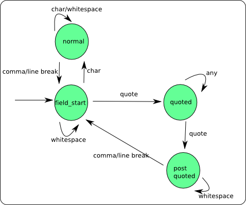

csv-parser
==========

CSV parser for java.

why parser for csv?
-------------------

The CSV file format have simple structure, like ',' (comma) for each field separate, and '\r' or '\n' for each line.
how ever call String#split(',') won't work, as there could be quoted fields that spans more than one line and contains 
commas or escaped quotes. 

Now, we will create a simple parser for RFC-4180 documents. As the format is really simple, we won't use yacc nor lex, 
but parse the input file using a simple state machine.

Our goals are:

	* Recognize fields delimited by commas, records delimited by line breaks 
    * Recognize quoted fields 
    * Being able to parse quotes, commas and line breaks inside quoted fields 

And we will handle the file encoding and the specified separator not only comma.

how does it work?
-----------------

A quick look at the parsing state:

	* Field start 
	  at the begin of each field. The whitespaces should be consider for unquoted fields, but any whitespace before a quoted
	  field is discarded
	
	* Normal
	  an unquoted field 
	
	* Quoted 
	  inside a quoted field 
	
    * Post Quoted 
	  after a quoted field. Whitespaces could appear between a quoted field and the next field/record, and should be discarded
	
there is a state machine map shows the changes:

	
how can I use the API?
----------------------	
	
We provide an api to parse the csv file like:

		CsvReader reader = new CsvReader("~/1120.csv");
		CsvDocument doc = csvReader.parse();
		int rows = doc.size();
		// get first row
		List row = doc.getRow(0);
		// get first col
		String name = row.get(0);
		...  
		
And handle encoding and separator like:

		CsvReader reader = new CsvReader("~/1120.csv", "GBK");
		CsvDocument doc = csvReader.parse(';'); // using ';' as field separator
		...